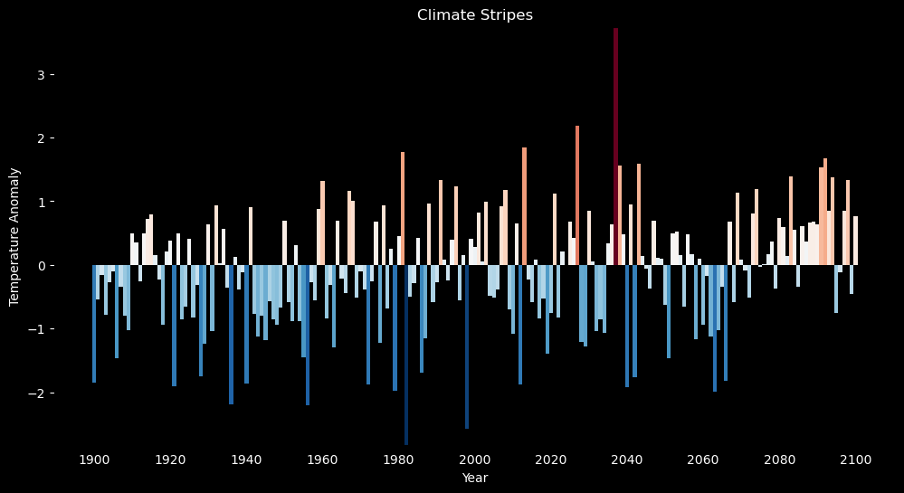
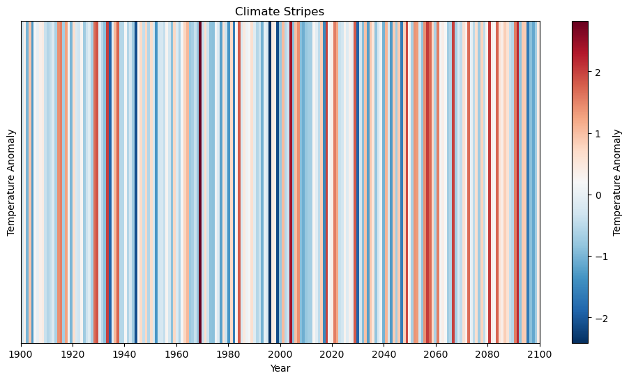
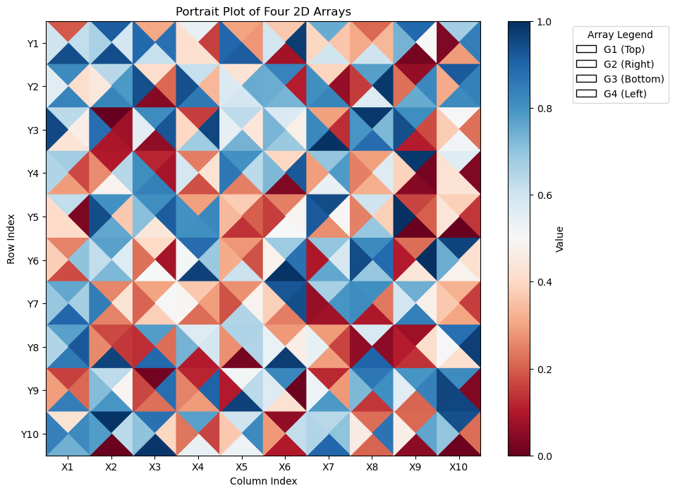
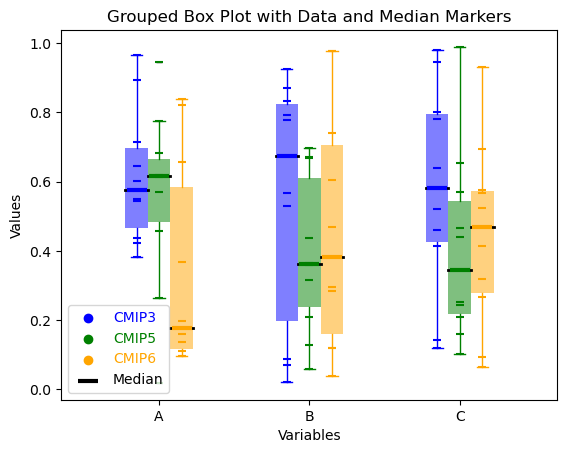
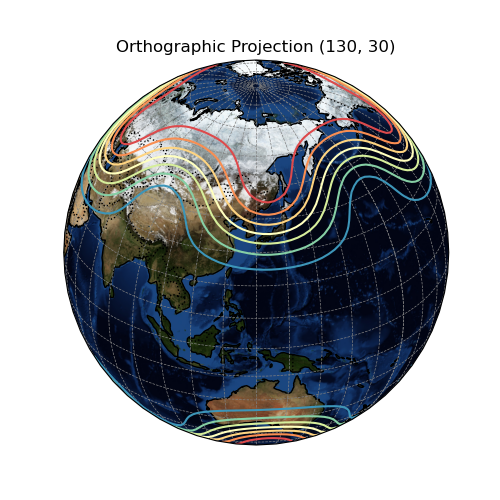
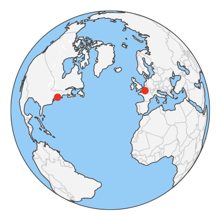

# notebooks

This repository contains a collection of example Python scripts in Jupyter Notebook for climate data analysis and visualization. 

## Example gallery: 

| [Climate Stripes](notebooks/climate_stripes.ipynb)      | [Portrait Plot](notebooks/portrait_plot.ipynb)      | [Grouped Box Plot](gallery/grouped_box_plot.png)      |
|--------------|--------------|--------------|
|  |  |  |

| [Globe Map](notebooks/globe_map.ipynb) | [Globe Map (interactive)](notebooks/globe_map_interactive.ipynb) 
|--------------|--------------|
|  | 
