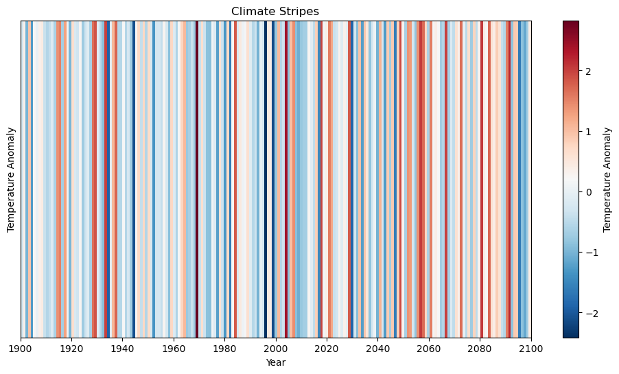
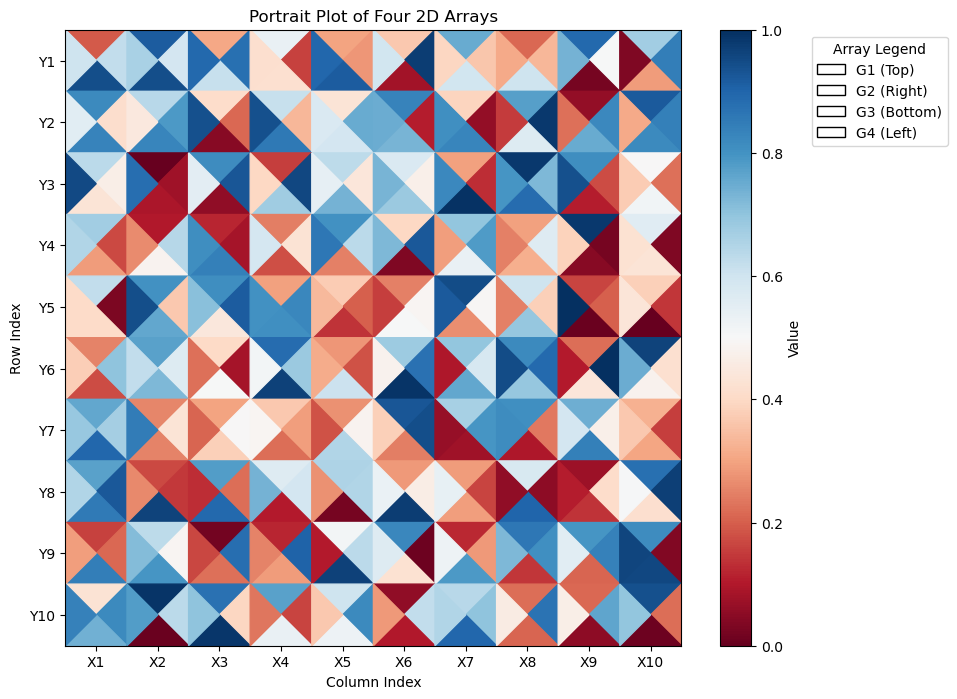
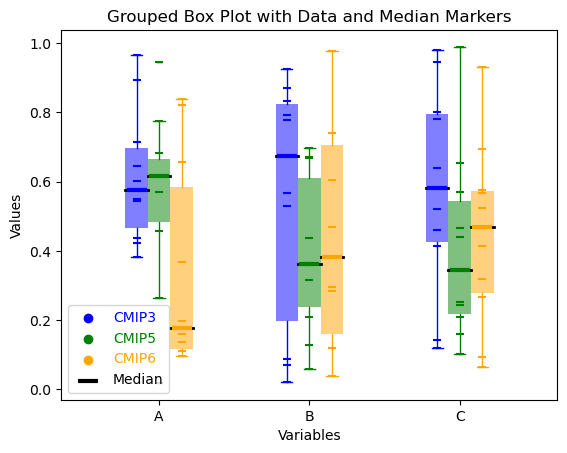

# notebooks

Some example notebooks used for climate data analysis

| [Climate Stripes](example_notebooks/climate_stripes.ipynb)      | [Portrait Plot](example_notebooks/portrait_plot.ipynb)      | [Grouped Box Plot](gallery/grouped_box_plot.png)      |
|--------------|--------------|--------------|
|  |  |  |
|  | | 
